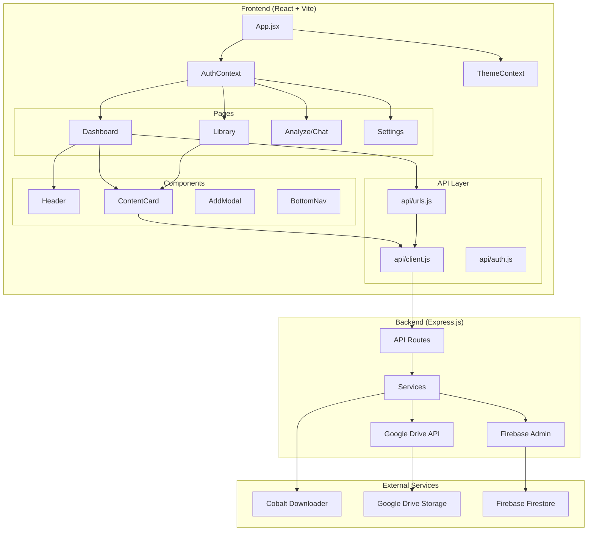
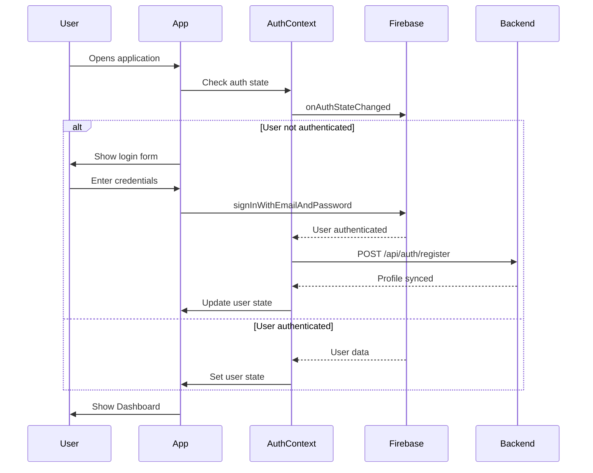
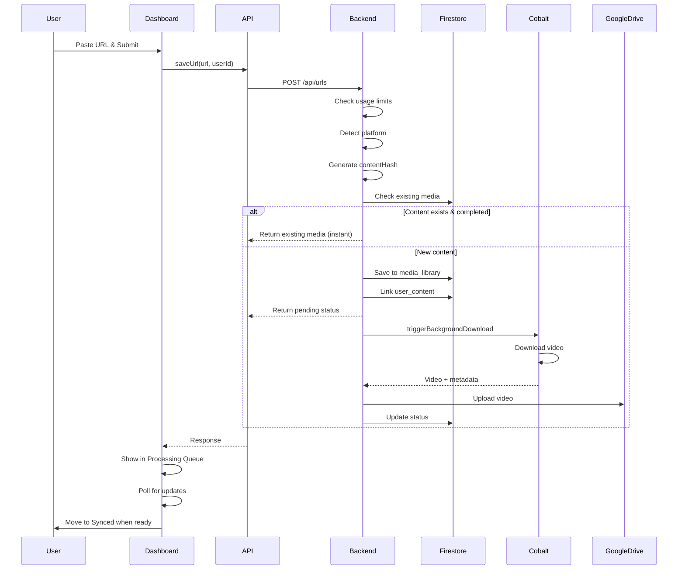
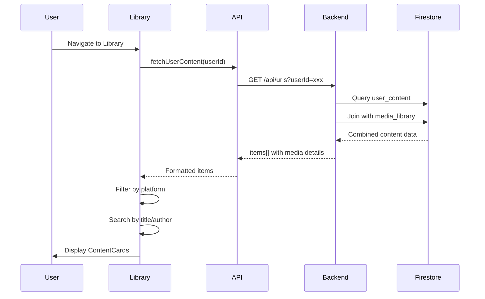
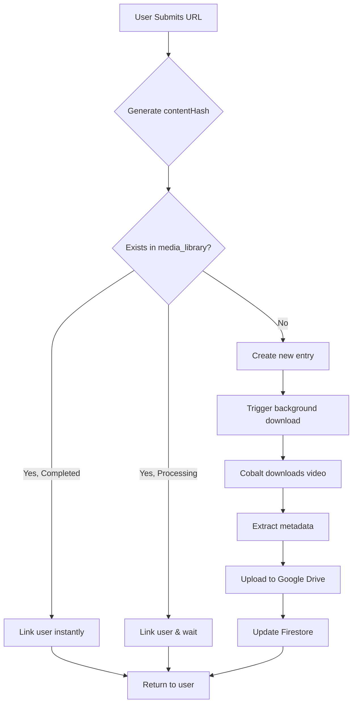

# MindStore Web Application - Technical Documentation

> **Purpose**: A comprehensive guide to understanding and building the MindStore web application - a media archival platform for saving, organizing, and searching content from social platforms.

---

## Table of Contents

1. [Overview](#overview)
2. [Technology Stack](#technology-stack)
3. [Architecture Diagram](#architecture-diagram)
4. [Directory Structure](#directory-structure)
5. [Application Flow](#application-flow)
6. [Core Features](#core-features)
7. [Frontend Components](#frontend-components)
8. [API Layer](#api-layer)
9. [Backend Services](#backend-services)
10. [Data Models](#data-models)
11. [Authentication Flow](#authentication-flow)
12. [Media Processing Pipeline](#media-processing-pipeline)
13. [State Management](#state-management)
14. [Environment Configuration](#environment-configuration)

---

## Overview

MindStore is a content archival platform that allows users to:
- Save content from social media platforms (Instagram, YouTube, Twitter/X, TikTok, LinkedIn)
- Automatically download and store media on Google Drive
- Browse and manage a personal media library
- Search through saved content via an AI-powered chat interface

---

## Technology Stack

| Layer | Technology |
|-------|------------|
| Frontend | React 18 + Vite |
| Routing | React Router v6 |
| Authentication | Firebase Auth |
| Database | Firebase Firestore |
| Storage | Google Drive API |
| Styling | Vanilla CSS with CSS Variables |
| State Management | React Context API |
| API Client | Fetch with custom wrapper |

---

## Architecture Diagram



---

## Directory Structure

```
web-app/
├── src/
│   ├── App.jsx              # Root component with routing
│   ├── main.jsx             # Application entry point
│   ├── index.css            # Global styles & design tokens
│   ├── App.css              # App-specific styles
│   │
│   ├── api/                 # API communication layer
│   │   ├── client.js        # Base HTTP client with error handling
│   │   ├── urls.js          # URL/content CRUD operations
│   │   └── auth.js          # Authentication API calls
│   │
│   ├── components/          # Reusable UI components
│   │   ├── ContentCard.jsx  # Media display card with ViewModal integration
│   │   ├── ContentCard.css
│   │   ├── ViewModal.jsx    # Full-screen media viewer (video + image gallery)
│   │   ├── ViewModal.css
│   │   ├── Header.jsx       # Page header with search
│   │   ├── Header.css
│   │   ├── BottomNav.jsx    # Mobile navigation
│   │   ├── BottomNav.css
│   │   ├── AddModal.jsx     # URL submission modal
│   │   ├── AddModal.css
│   │   ├── Layout.jsx       # Page layout wrapper
│   │   ├── Layout.css
│   │   ├── ErrorBoundary.jsx # Error handling wrapper
│   │   └── ErrorBoundary.css
│   │
│   ├── contexts/            # React Context providers
│   │   ├── AuthContext.jsx  # Firebase authentication state
│   │   └── ThemeContext.jsx # Dark/light theme management
│   │
│   ├── lib/                 # Utilities & configurations
│   │   └── firebase.js      # Firebase client initialization
│   │
│   └── pages/              # Route page components
│       ├── Dashboard.jsx    # Home page with overview
│       ├── Dashboard.css
│       ├── Library.jsx      # Media library with filters
│       ├── Library.css
│       ├── Analyze.jsx      # AI chat interface
│       ├── Analyze.css
│       ├── Settings.jsx     # User preferences
│       └── Settings.css
│
├── .env                    # Development environment
├── .env.production         # Production environment
├── vite.config.js          # Vite build configuration
└── package.json            # Dependencies & scripts
```

---

## Application Flow

### 1. User Authentication Flow



### 2. Content Saving Flow



### 3. Content Display Flow



---

## Core Features

### Dashboard (`/`)
- **Welcome Screen**: Shows login form for unauthenticated users
- **Processing Queue**: Items being downloaded (status: pending/processing)
- **Synced Files**: Items uploaded to Google Drive
- **All Content**: Completed items with metadata
- **Auto-refresh**: Polls every 3 seconds when processing items exist

### Library (`/library`)
- **Paginated Content**: 10 items per page, infinite scroll
- **Platform Filters**: ALL, Instagram, YouTube, Twitter, LinkedIn, TikTok
- **Search**: Filter by title, author, or platform
- **Bulk Selection**: Multi-select for batch deletion
- **Auto-poll**: Refreshes every 5 seconds when items are processing

### Analyze/Chat (`/analyze`)
- **AI Chat Interface**: Query saved content
- **Result Cards**: Display matching videos with thumbnails
- **Suggestions**: Quick-action buttons
- **Status Indicators**: Shows indexing progress

### Settings (`/settings`)
- **Theme Toggle**: Dark/Light mode
- **Account Info**: Email and tier display
- **Logout**: Sign out functionality

---

## Frontend Components

### ContentCard (`components/ContentCard.jsx`)

The main display component for media items. Features:

| Feature | Description |
|---------|-------------|
| **Status Detection** | Handles: pending, processing, completed, uploaded, failed states |
| **Thumbnail Fallback** | Uses Google Drive thumbnail if platform thumbnail unavailable |
| **Image Proxying** | Routes external images through `/api/image-proxy` for CORS |
| **Platform Tags** | Color-coded tags (#INSTA, #YOUTUBE, #TWITTER, etc.) |
| **Variants** | `grid` (default) and `queue` (for processing items) |
| **View Button** | Opens ViewModal for synced content |
| **Sync Badge** | Shows "SYNCED" indicator for Drive-backed content |

```javascript
// Status logic
const isPending = status === 'pending' || status === 'processing'
const isFailed = status === 'failed' && hasMetadata
const isCompleted = status === 'completed' || status === 'uploaded'
const isViewable = isCompleted && (driveFileId || driveViewLink)
```

### ViewModal (`components/ViewModal.jsx`)

Full-screen modal for viewing media content:

| Feature | Description |
|---------|-------------|
| **Video Player** | Google Drive embedded iframe for video playback |
| **Image Gallery** | Arrow navigation for carousel content |
| **Mixed Media** | Supports carousels with both videos and images |
| **Keyboard Navigation** | Escape to close, Left/Right arrows for gallery |
| **Metadata Display** | Platform badge, title, author, caption |
| **Action Buttons** | "View Source" and "Open in Drive" links |

```javascript
// Gallery building from mediaItems array
const galleryImages = media.mediaItems?.map(item => ({
    url: getActualDriveUrl(item),
    driveId: item.driveFileId,
    type: item.mediaType || 'image',
    isVideo: item.mediaType === 'video'
}))
```

### Header (`components/Header.jsx`)

Page header with optional search functionality:
- Title and subtitle display
- Optional search input with debounce
- Theme-aware styling

### Layout (`components/Layout.jsx`)

Wraps all pages with:
- Outlet for nested routes
- Bottom navigation bar
- Consistent padding/margin

---

## API Layer

### Client (`api/client.js`)

Base HTTP client with centralized error handling:

```javascript
// Configuration
const API_BASE = import.meta.env.VITE_API_URL || 'http://localhost:3001/api'

// Methods
export function get(endpoint, options = {})
export function post(endpoint, body, options = {})
export function put(endpoint, body, options = {})
export function del(endpoint, body, options = {})

// Error class
export class ApiError extends Error {
    constructor(message, status, data = null)
}
```

### URLs API (`api/urls.js`)

Content management operations:

| Function | Endpoint | Description |
|----------|----------|-------------|
| `fetchUserContent(userId, {limit, offset})` | GET /urls | Fetch paginated content |
| `saveUrl(url, userId)` | POST /urls | Save new URL |
| `deleteUrl(contentHash, userId)` | DELETE /urls/:hash | Remove content |
| `deleteMultipleUrls(hashes, userId)` | Multiple DELETE | Batch removal |

---

## Backend Services

### URL Routes (`routes/urls.js`)

| Endpoint | Method | Description |
|----------|--------|-------------|
| `/api/urls` | POST | Submit URL for processing |
| `/api/urls` | GET | Fetch user's saved content |
| `/api/urls/:contentHash` | GET | Get specific media details |
| `/api/urls/:contentHash` | DELETE | Remove from user's library |
| `/api/urls/:contentHash/refresh` | POST | Re-fetch metadata |
| `/api/urls/refresh-all` | POST | Bulk metadata refresh |
| `/api/urls/migrate-thumbnails` | POST | Move thumbnails to Drive |

### Key Services

| Service | Purpose |
|---------|---------|
| `sharedContent.js` | Content deduplication & user linking |
| `downloadWorker.js` | Background video downloading |
| `mediaRouter.js` | Platform detection & URL routing |
| `instagramMetadata.js` | Instagram metadata scraping |
| `twitterMetadata.js` | Twitter/X metadata fetching |
| `youtubeMetadata.js` | YouTube metadata extraction |
| `thumbnailStorage.js` | Thumbnail upload to Google Drive |
| `usageTracker.js` | Monthly usage limits |

---

## Data Models

### Firestore Collections

#### `media_library` - Global media repository
```javascript
{
  // Document ID: contentHash
  url: "https://instagram.com/p/xxx",
  platform: "instagram",
  contentId: "xxx",
  title: "Video Title",
  author: "@username",
  caption: "Full caption text...",
  thumbnailUrl: "https://drive.google.com/...",
  mediaType: "video",
  mediaCount: 1,
  downloadStatus: "completed", // pending | processing | completed | failed
  driveFileId: "1abc...",
  driveViewLink: "https://drive.google.com/file/d/...",
  createdAt: Timestamp,
  updatedAt: Timestamp
}
```

#### `user_content` - User-media associations
```javascript
{
  // Document ID: {userId}_{contentHash}
  userId: "firebase-uid",
  contentHash: "sha256...",
  savedAt: Timestamp,
  notes: "User notes",
  tags: ["tag1", "tag2"]
}
```

#### `users` - User profiles
```javascript
{
  // Document ID: userId
  email: "user@example.com",
  displayName: "User Name",
  tier: "free", // free | premium
  createdAt: Timestamp
}
```

---

## Authentication Flow

### Firebase Integration

```javascript
// AuthContext provides:
const value = {
    user,           // Current user object
    loading,        // Auth state loading
    error,          // Auth errors
    signIn,         // Email/password sign in
    signUp,         // Create new account
    logout,         // Sign out
    isAuthenticated // Boolean check
}
```

### Extension Sync

When user authenticates, their ID is synced to the browser extension:

```javascript
function syncUserIdToExtension(userId, email, displayName) {
    // Store in localStorage
    localStorage.setItem('firebaseUserId', userId)
    
    // Send to extension via postMessage
    window.postMessage({
        type: 'MINDSTORE_AUTH_SYNC',
        userId,
        email,
        displayName
    }, '*')
}
```

---

## Media Processing Pipeline

### Content Deduplication



### Download Worker

The `downloadWorker.js` service handles:
1. **Platform Detection**: Identify source (Instagram, YouTube, etc.)
2. **Cobalt Integration**: External service for video download
3. **Metadata Extraction**: Title, author, thumbnail from response
4. **Drive Upload**: Store video permanently
5. **Status Updates**: Real-time Firestore updates

---

## State Management

### Global State (Contexts)

```javascript
// Theme Context
const ThemeContext = {
    theme: 'dark' | 'light',
    toggleTheme: () => void
}

// Auth Context  
const AuthContext = {
    user: { id, email, displayName, tier } | null,
    loading: boolean,
    signIn, signUp, logout: async functions
}
```

### Local State Patterns

```javascript
// Content loading with polling
useEffect(() => {
    const hasProcessing = items.some(
        item => item.media?.downloadStatus === 'processing'
    )
    
    if (hasProcessing) {
        const interval = setInterval(loadContent, 3000)
        return () => clearInterval(interval)
    }
}, [items])

// Global event dispatch for cross-component updates
window.dispatchEvent(
    new CustomEvent('mindstore:content-updated', { detail: { source } })
)
```

---

## Environment Configuration

### Required Variables

```bash
# Backend API
VITE_API_URL=http://localhost:3001/api

# Firebase Authentication
VITE_FIREBASE_API_KEY=xxx
VITE_FIREBASE_AUTH_DOMAIN=xxx.firebaseapp.com
VITE_FIREBASE_PROJECT_ID=xxx
VITE_FIREBASE_STORAGE_BUCKET=xxx.appspot.com
VITE_FIREBASE_MESSAGING_SENDER_ID=xxx
VITE_FIREBASE_APP_ID=xxx
```

### Development vs Production

| Variable | Development | Production |
|----------|-------------|------------|
| `VITE_API_URL` | `http://localhost:3001/api` | `https://api.mindstore.app/api` |
| Firebase | Same project, different apps | Production Firebase project |

---

## Build & Development Commands

```bash
# Install dependencies
npm install

# Development server
npm run dev

# Production build
npm run build

# Preview production build
npm run preview
```

---

## Key Design Decisions

### 1. Content Deduplication
- Same URL = Same `contentHash`
- Multiple users can save same content
- Only downloads once, links to all users

### 2. Background Processing
- Non-blocking URL submission
- Frontend polls for status updates
- Users see immediate feedback

### 3. Thumbnail Fallbacks
- Try platform thumbnail first
- Fallback to Google Drive thumbnail
- Generate placeholder if both fail

### 4. Lazy Loading
- Pages are code-split via `lazy()`
- Images use native `loading="lazy"`
- 10-item pagination for fast initial load

### 5. Extension Integration
- localStorage for persistence
- postMessage for real-time sync
- Seamless authentication sharing

---

## Error Handling

### Frontend
```javascript
// API client catches all errors
try {
    const data = await fetchUserContent(userId)
} catch (error) {
    if (error instanceof ApiError) {
        // Handle known API errors
    } else {
        // Handle network/unknown errors
    }
}
```

### Backend
- All routes wrapped in try/catch
- Consistent error response format:
  ```json
  { "success": false, "error": "Message", "message": "Details" }
  ```

---

## Future Considerations

- [ ] Real-time updates via WebSockets
- [ ] Offline support with Service Workers
- [ ] Full-text search via embeddings
- [ ] Video transcription and summarization
- [ ] Collaborative folders/sharing
